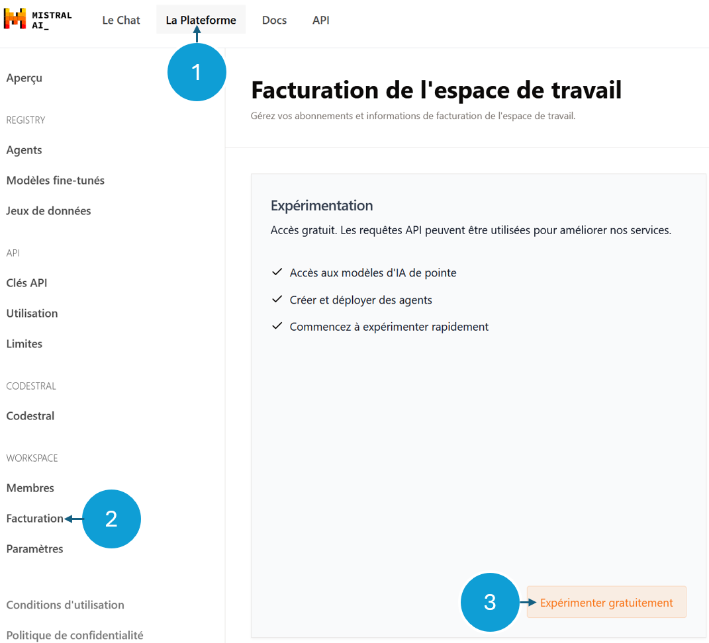

# Assistant Vélo'v 🤖🚴

## 📄 La mission

Vous êtes contacté par la métropole de Lyon pour fournir un chatbot capable d'assister les usager·ère·s des [Vélo'v](https://velov.grandlyon.com/fr/home) (vélo en libre service) dans leurs demandes du quotidien.

Pas facile ! Heureusement, vos connaissances concernant les dernières technologies du traitement du langage (RAG, LLM, Agents, Embeddings) peuvent vous aider ! 😉

Le client vous indique que les questions des usager·ère·s peuvent porter sur le contenu de leur [site internet](https://velov.grandlyon.com/fr/home), ainsi que sur la (très grande) quantité de données disponibles sur [data.gouv](https://transport.data.gouv.fr/datasets/stations-velov-de-la-metropole-de-lyon-disponibilites-temps-reel)...

Avant de se lancer dans un projet d'une telle envergure, on vous demande simplement d'effectuer **un POC** (preuve de concept) **sur quelques données**, afin de donner un aperçu de ce qu'il est possible de faire.

## 📅 Les données

Pour le test, des données on été préparées. Vous les trouverez dans le dossier [data](./data). Elles incluent : 

- **abonnements.md** : un extrait du site, au format markdown, qui contient des informations sur les prix des abonnements
- **stations.csv** : un fichier csv qui contient des informations relatives au stations velov (capacité, disponibilité)

## ⚙️ Contraintes

Vous êtes **libre de choisir la méthodologie** que vous souhaitez pour mettre en place dans la conception du chatbot. Cela inclut : 
- les techniques d'IA employées
- les frameworks utilisés

Toutefois, voici quelques contraintes :

- ne pas y passer trop de temps ! C'est un petit test, pas un projet à mettre en production.
- implémentation majoritairement en Python.
- garder à l'esprit la scalabilité, éviter les traitement manuels.

## 💌 Les livrables

Le livrable est le code qui fait fonctionner votre agent. Idéalement il permet de poser une question via un simple commande du type ``python main.py <question_utilisateur>`` pour obtenir une réponse, mais cela dépend de vous.

Le code peut être partagé sous la forme d'un repo git, ou bien envoyé sous la forme d'un .zip.

**Gerder à l'esprit que :**

- il s'agit d'un **petit test** technique. Mettez y ce qui vous plaît mais merci de ne pas y passer trop de temps. Le but est de faire un prototype de chatbot, pas un AGI omnisciente 😶‍🌫️ !

- Si le chatbot ne répond pas toujours bien, ou même pas souvent bien **ce n'est pas grave** ! Le but est plus de voir la méthodologie utilisée que le résultat final.

- Le résultat fera l'objet d'une discussion lors de l'entretien technique.

## ❓ Exemples de questions

- Combien me coûterait la location d'un Vélo'v à la journée ?
- Y-a-t-il des Vélo'v disponibles à la station <nom_de_station> ?

## Ressources supplémentaires

### API LLM

Si jamais vous ne disposez pas d'accès à un LLM, nous vous suggérons d'utiliser l'API gratuite de [Mistral AI](https://console.mistral.ai/billing). Pour ce faire vous pouvez simplement créer un compte sur ``La plateforme >> facturation >> expérimenter gratuitement``

